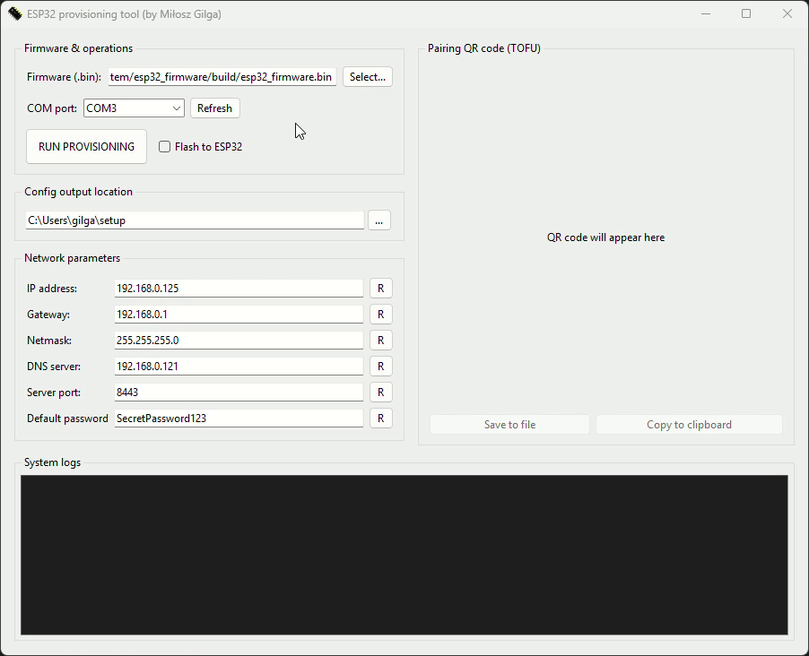

# Home theater automation system

[TBD]

## Table of content

* [Hardware and software stack](#hardware-and-software-stack)
* [Author](#author)
* [License](#license)

## Hardware

[TBD]

## Software

### ESP32 firmware

[TBD]

### Provisioning tool (certgen and ESP32 flashing)

This desktop tool handles the configuration and flashing of the ESP32 Home Theater firmware. It generates
the necessary SSL certificates and private keys for the HTTPS server, and produces a QR code that allows
the Android client to connect instantly without manual setup. The application can flash the device via UART
by combining the base firmware binary (available in Releases tab) with a LittleFS storage partition that is
generated on the fly based on your input and the partition table (located in `esp32_firmware/partitions.csv`).

### Android client

[TBD]

## Hardware and software stack

* ESP32 WROOM DevKit,
* ESP-IDF, ESP-LittleFS, C, CMake, Make,
* MAX3232 (TTL <-> RS232), MAX3485 (TTL <-> RS485), W5500 (LAN),
* I2C, PCF8574, LCD 1602 HD44780 (FFSTN),
* PKI with CA (MITM attacks protection), basic auth,
* Python (esptool, littlefs-python, cryptography, pyserial, qrcode),
* Android (Kotlin).

## Author

Created by Miłosz Gilga. If you have any questions about this application, send
message: [miloszgilga@gmail.com](mailto:miloszgilga@gmail.com).

## License

This project is licensed under the GNU General Public License v3.0.
