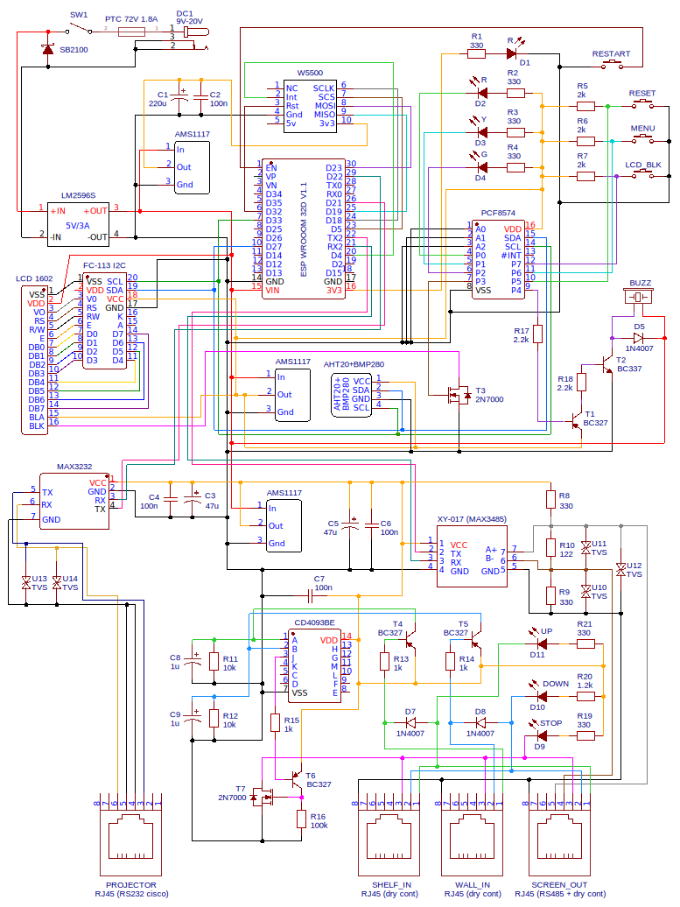
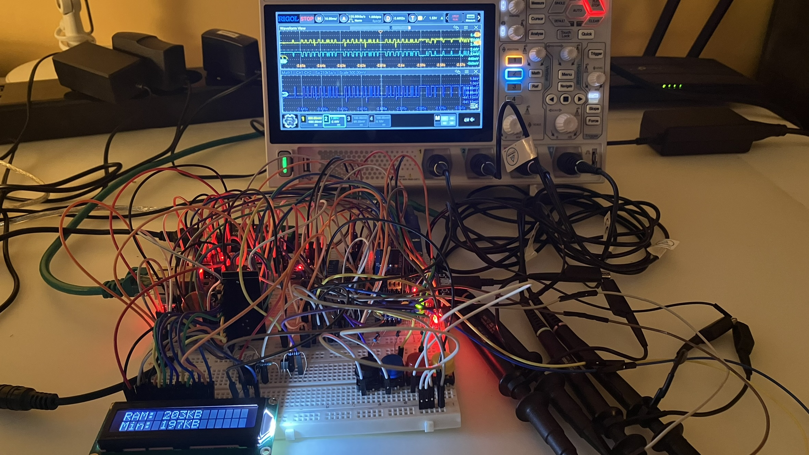
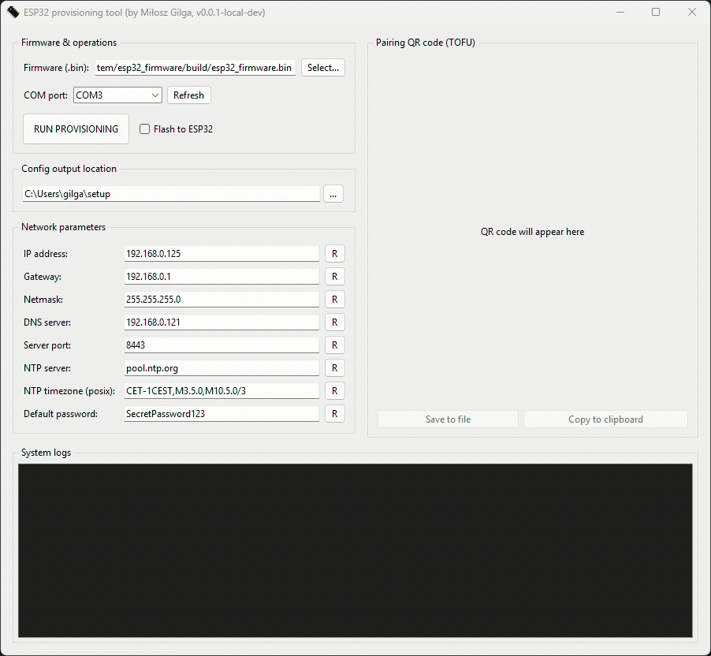
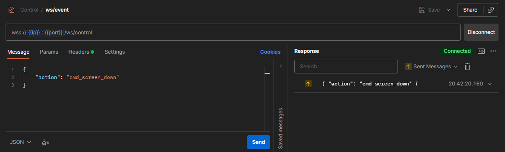
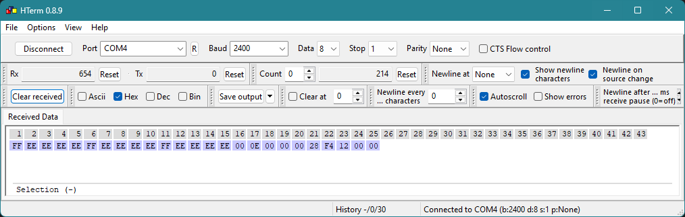
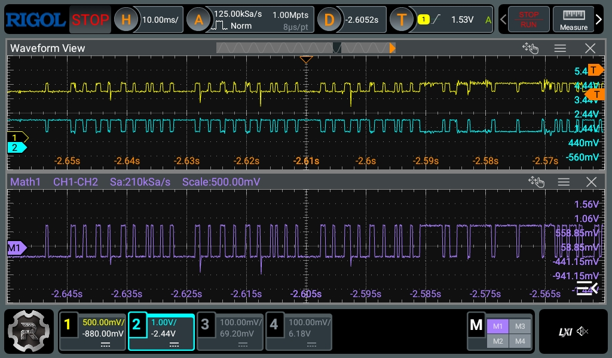

# Home theater automation system

A specialized ESP32-based home theater controller operating via a hardwired Ethernet connection. It communicates using
TLS-encrypted WebSockets and interfaces with a native Android application and a Python provisioning tool. The firmware
includes dedicated serial protocol implementations for the **Optoma UHD 38x** projector (via RS232) and the
**Suprema Polaris Pro** projection screen (via RS485).

* **Installation & provisioning:** See [INSTALL](./INSTALL.md) for instructions on how to flash and set up the device.
* **Development:** See [CONTRIBUTING](./CONTRIBUTING.md) for setting up the environment and building artifacts.

## Table of content

* [Hardware](#hardware)
* [Software](#software)
* [RS485 data transmission example](#rs485-data-transmission-example)
* [Hardware and software stack](#hardware-and-software-stack)
* [Author](#author)
* [License](#license)

## Hardware

[Click to open schematic in PDF format](.github/schematic/esp32-driver.pdf)



The​‍​‌‍​‍‌ LM2596S switching regulator (5V/3A) centrally delivers power to the system. This main supply is then split to three
separate segments, each powered by its own AMS1117 linear regulator that steps down the voltage to 3.3V, thus preventing
noise interference (5V parts, such as the buzzer and the LCD display, get their power directly from the 5V rail). Major
communication modules: Ethernet W5500, MAX3232, and MAX3485 - internally coupled decoupling circuits have been used
which consist of a ceramic capacitor (for high-frequency filtering) combined with a Low-ESR capacitor. In the case of
the Ethernet module, the size of the electrolytic capacitor was raised to 220uF in order to get rid of the connection
drops which were unstable and hence could be eliminated with the help of standard 47uF units ​‍​‌‍​‍‌only.

A​‍​‌‍​‍‌ PCF8574 expander is used to handle the I/O for the user interface (buttons, LEDs, buzzer, LCD backlight). Since the
expander can only source a small amount of current, most peripherals are ground-controlled (active low). The control
panel functions RESTART, RESET (factory defaults), MENU navigation and screen backlight toggling (LCD_BLK) aresupported.
The 1602 LCD (white on black) is driven by a modified FC-113 I2C converter at 3.3V logic levels (compatiblewith the
ESP32). Baclilight control (anode) is done via a MOSFET transistor which is triggered by pin P3 of the I2C ​‍​‌‍​‍‌expander.

The​‍​‌‍​‍‌ RS485 line, which is controlled by the XY-017 (MAX3485), has a 122om termination resistor (R10), and there is a bias
network with 330omresistors that pull line A+ to 3.3V (R8) and line B- to ground (R9). The purpose of these components
is to make sure that the idle differential voltage is higher than the +-200mV threshold, which is the one recommended by
the RS485/modbus standards. Both RS232 and RS485 interfaces have TVS diodes protection (line-to-ground and differential)
which protect the interfaces against voltage spikes coming from equipment such as the projection screen motor. The
buzzer circuit (5V), being driven by 3.3V logic, employs a cascaded transistor pair by means of a BC327 (T1) and BC337
(T2); in addition, a diode (D5) is set in reverse parallel across the buzzer coil to safeguard the driver transistor
from inductive kickback voltage spikes resulting from the buzzer coil operation. Besides, a passive circuit built around
an SN74HC02 NOR gate can generate a STOP signal through pressing two buttons on a wall-mounted shutter switch
simultaneously. The RS485 differential signals (A+ and B-) are assigned to pins 4 and 5 of the RJ45 connector so that a
twisted pair within the UTP cable can be used, which will dramatically decrease the electromagnetic interference
(common-mode noise rejection).

### Standalone unit (boxed)

[TBD] - under development

### Prototype (DUT) with test bench

For the test, I used a Rigol DHO804 oscilloscope, and it had these x10 probes attached, all set up with DC coupling.
That way, channels 1 and 2 could pick up the differential RS485 signals, you know, the A+ and B- ones that send over the
`cmd_screen_down` command to the projection screen. The RS232 stuff on CH3 and CH4, though, those probes were just
turned off for this part, since it wasnt needed in the sequence.



The setup on the bench includes these extra converters so that I can watch things on the oscilloscope and hook up to the
PC at the same time. It seems kind of necessary for checking everything without switching around too much. For the RS485
part, theres a separate USB adapter that handles it on its own. Then the TTL to RS232 conversion uses this tweaked
MAX3232 module. They took off the regular DB9 connector by hand and put in goldpins instead, connecting pin 5 to ground,
3 to TXD, and 2 to RXD, all to fit with the RJ45 interface in the end design. One thing to avoid was those ground loops
and the problem of powering it twice, especially since the whole system runs off a 9V 3A supply through an LM2596S DC-DC
converter. So for the mini USB cable thats used to program and debug the ESP, I cut the +5V line, just keeping the
ground and data lines linked up.

And theres a quick video from above showing the system working.

https://github.com/user-attachments/assets/9b0b8d48-a2f2-4973-bb6c-5a5791618fee

## Software

### ESP32 firmware

The embedded firmware layer for the controller was developed directly within the ESP-IDF framework, utilizing FreeRTOS,
while the Arduino ecosystem was bypassed to ensure complete control over system resources and performance optimization.
A modular CMake architecture was adopted, wherein hardware drivers remain strictly separated from business logic,
facilitating communication exclusively through callback mechanisms. Regarding network connectivity, a hybrid approach
was implemented in which REST APIs manage critical configuration updates and authorization, while WebSockets are
utilized for real-time control to eliminate input lag. Server-Sent Events (SSE) were explicitly rejected due to the
limitations imposed by the single-threaded nature of the HTTP server, which poses significant concurrency challenges, as
well as to avoid the cumulative latency inherent in standard REST-based interactions. Furthermore, to prevent slower bus
operations, such as those involving UART or I2C interfaces, from blocking the network thread, asynchronous processing is
enforced via queues utilizing a Producer-Consumer model.

### Provisioning tool (certgen and ESP32 flashing)

This desktop tool handles the configuration and flashing of the ESP32 Home Theater firmware. It generates the necessary
SSL certificates and private keys for the HTTPS server, and produces a QR code that allows the Android client to connect
instantly without manual setup. The application can flash the device via UART by combining the base firmware binary
(available in Releases tab) with a LittleFS storage partition that is generated on the fly based on your input and the
partition table (located in `esp32_firmware/partitions.csv`).



### Android client

[TBD] - under development

## RS485 data transmission example

The screen control process is initiated at the application layer, where the user issues the command
`{"action":"cmd_screen_down"}` via the websocket interface. The ESP32 microcontroller receives, interprets, and queues
the message, eventually passing it to the transport layer, which transmits the raw hexadecimal sequence via UART to the
MAX3485 transceiver; the correct formatting of this data packet is clearly visible in the HTerm serial monitor.



Declared HEX command sequence directly send via RS485:

```c
static const uint8_t CMD_SCREEN_DOWN[] = {
  0xFF, 0xEE, 0xEE, 0xEE, 0xEE, 0xFF, 0xEE, 0xEE, 0xEE, 0xEE, 0xFF, 0xEE, 0xEE,
  0xEE, 0xEE, 0x00, 0x0E, 0x00, 0x00, 0x00, 0x28, 0xF4, 0x12, 0x00, 0x00
};
```

Received HEX command sequence from MAX3485 module, directly after TVS diode and terminator with bias (MAX3485 ->
terminator with bias -> TVS -> RS485 to USB -> HTerm):



The transceiver converts this logic signal into a differential transmission, verified via oscilloscope measurements. As
referenced in the hardware section, the use of bias resistors ensures that the differential signal (A-B) maintains a
stable idle state above +200mV (logic "1"), while reliably dropping below the -200mV threshold (to approximately -440mV)
during active transmission, ensuring error-free frame interpretation by the screen controller.



## Hardware and software stack

* ESP32 WROOM DevKit v1,
* MAX3232 (TTL <-> RS232), MAX3485 (TTL <-> RS485), W5500 (LAN),
* I2C, PCF8574, FC-113, LCD 1602 HD44780 (FFSTN),
* LM2596S DC-DC Step-Down 12V -> 5V, AMS1117 DC-DC Step-Down 5V -> 3.3V (power section),
* AHT20+BMP280, BMT1206UXLF,
* 2N7000 (MOSFET), BC337 (NPN), BC327 (PNP), 1N4007, SB2100, P6KE15CA,
* SN74HC02 (NOR),
* ESP-IDF, ESP-LittleFS, C, CMake, Make,
* PKI with CA (MITM attacks protection), basic auth,
* Python (esptool, littlefs-python, cryptography, pyserial, qrcode),
* Android (Kotlin).

## Author

Created by Miłosz Gilga. If you have any questions about this project, send message:
[miloszgilga@gmail.com](mailto:miloszgilga@gmail.com).

## License

This project is licensed under the GNU General Public License v3.0.
